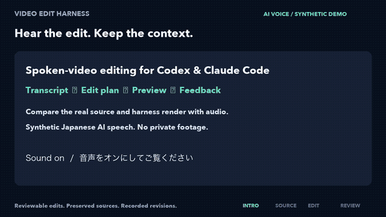

[English](README.md) | 日本語

# Video Edit Harness

対話動画の編集、色の比較、音声の正規化、字幕、Final Cut Pro XML への引き継ぎを、ローカルで確認しながら進めるためのワークフローです。セッションには、編集方針、文字起こし、単語に紐づく編集計画、レンダリング結果、時刻付きのフィードバック、納品時の確認記録をまとめて保存します。元のメディアと過去の改訂版も保持します。

これは **アルファ版** です。POSIX ツールを備えた macOS または Linux で動作します。Final Cut Pro（FCP）の GUI での読み込みと確認には、macOS とインストール済みの FCP が必要です。FCPXML の検証だけでは、FCP でプロジェクトを開いて再生できたことの証明にはなりません。

## デモ

[](https://github.com/ekusiadadus/video-edit-harness/releases/download/v0.1.0-alpha.2/video-edit-harness-demo-v2.mp4)

**[音声付きデモを見る・ダウンロードする（MP4）](https://github.com/ekusiadadus/video-edit-harness/releases/download/v0.1.0-alpha.2/video-edit-harness-demo-v2.mp4)** — 元映像 → 間を短くした版 → 字幕・色・音声の修正 → 単語の保持 → FCP への引き継ぎを示します。上の GIF は無音です。MP4 には編集前後の日本語音声が含まれます。

このデモには **OpenAI の `marin` によるAI生成の日本語音声**とテストパターンを使用しています。編集部分は実際にこのツールでレンダリングしたものです。前後の説明画面はワークフローを図示しています。測定結果と制約は[デモの出典・検証記録](docs/demo/README.md)をご覧ください。

Codexで実際の動画を編集する画面を収録する場合は、[Screen Studioの録画手順](docs/SCREEN_RECORDING.ja.md)をご覧ください。上のデモは説明画面を組み合わせたもので、Codex画面の録画ではありません。

## インストール

必要なもの：Python 3.11 以降、[uv](https://docs.astral.sh/uv/)、`PATH` 上の `ffmpeg` と `ffprobe`。クラウド文字起こしには、さらにプロバイダーの認証情報と、その素材をアップロードする許可が必要です。ローカルの Whisper モデルはインストールも実行もしません。

```sh
git clone --branch v0.1.0-alpha.3 https://github.com/ekusiadadus/video-edit-harness.git
cd video-edit-harness
uv sync --locked
uv run video-harness --help
uv run video-harness session --help
```

[リリース](https://github.com/ekusiadadus/video-edit-harness/releases/tag/v0.1.0-alpha.3)には、wheel、ソースアーカイブ、別配布のスキル ZIP、SHA256SUMS が含まれます。wheel にはプリセットが含まれます。このチェックアウトの外で使用する場合、出力先の初期値は現在の作業ディレクトリです。このリリースは PyPI には公開していません。

同梱の `video-editing` スキルをプロジェクトで使うには、`.agents/skills/video-editing` をそのプロジェクトの `.agents/skills/` にコピーします。Claude Code では、相対シンボリックリンクまたはコピーによる `.claude/skills/video-editing` と `CLAUDE.md` を通じて同じディレクトリを利用できます。代わりに、`~/.agents/skills/video-editing` または `~/.claude/skills/video-editing` にコピーしてもかまいません。このチェックアウト以外からスキルを呼び出す場合は、`VIDEO_EDIT_HARNESS_ROOT` にこのチェックアウトのパスを設定してください。更新時は、確認済みのタグに固定してください。スキルの指示だけでは、アップロードや公開は許可されません。

簡潔な手順は[日本語ワークフロー](docs/WORKFLOW.ja.md)を参照してください。スキルのディレクトリ構成は、[Codex のスキル文書](https://developers.openai.com/codex/skills/)と[Claude Code のスキル文書](https://code.claude.com/docs/en/skills)に従っています。

個人用にスキルをインストールするには、スキル ZIP から展開した `video-editing/` ディレクトリを `~/.agents/skills/`（Codex）または `~/.claude/skills/`（Claude Code）にコピーし、チェックアウトの場所を指定します。

```sh
export VIDEO_EDIT_HARNESS_ROOT="/absolute/path/to/video-edit-harness"
```

Python wheel は `uv pip install /path/to/video_edit_harness-0.1.0a3-py3-none-any.whl` で仮想環境にもインストールできます。その環境から `video-harness` を実行してください。単独配布のスキルには、テンプレートとエージェント向け指示を参照するため、このチェックアウトが必要です。

## スキルとして導入する

[スキル導入ガイド](docs/SKILL_INSTALL.ja.md)に、Codexの検出方法、単体スキルZIP、Claude Codeプラグインの導入手順をまとめています。GitHubから配布するコミュニティ版で、各社の公式キュレーション一覧への掲載ではありません。

```sh
claude plugin marketplace add ekusiadadus/video-edit-harness
claude plugin install video-editing@video-edit-harness
```

Codexでは`$video-editing`、Claude Codeでは`/video-editing:video-editing`で呼び出します。`VIDEO_EDIT_HARNESS_ROOT`に、タグで固定したハーネスのチェックアウトを指定してください。アップロード禁止は文字起こしと公開の両方に適用します。ローカルでの色調整には文字起こしは不要です。

### TikTok・Reels・Shorts

専用の`tiktok`スキルを導入すると、Claude Codeで`/tiktok /path/to/video.mov`、Codexで`$tiktok`と呼び出せます。プラグイン経由では`/video-editing:tiktok`です。場面に合わせた色調整、許可された文字起こしに基づく短尺編集、9:16の納品を扱います。[TikTok編集手順](docs/TIKTOK.ja.md)で1080×1920への整形と字幕の使い方を説明しています。既定でアップロードや投稿は行いません。

## 対話動画のセッション

プロジェクトのテンプレートをコピーし、`source` に素材の**実在する絶対パス**を設定します。素材に合わせて `input_color` を `rec709` または `apple_log` にし、音声トラックとプレビュー区間を確認してください。JSON に認証情報を入れないでください。テンプレート内のパスと単語 ID は仮の値です。

```sh
cp projects/talk.template.json projects/my-talk.json
# Edit projects/my-talk.json: source, input_color, preview interval, and editorial brief.
uv run video-harness session start projects/my-talk.json output/my-session \
  --brief-file examples/workflow-brief.json --actor codex
uv run video-harness session status output/my-session --deep
```

素材のアップロードが許可されたら、`OPENAI_API_KEY` を設定して文字起こしします。自動ルーティングでは、まず OpenAI を試し、Azure OpenAI が設定されていれば次に試します。Azure では `AZURE_OPENAI_API_KEY`、`AZURE_OPENAI_ENDPOINT`、`AZURE_OPENAI_TRANSCRIPTION_DEPLOYMENT`、`AZURE_OPENAI_TIMESTAMP_DEPLOYMENT` を使用し、`AZURE_OPENAI_API_VERSION` は任意です。文字起こしには API 料金が発生します。意味内容を表すテキストと単語の時刻は別々の API 応答から取得します。対応関係を推測で作らず、不一致の警告を確認してください。既存の封印済み文字起こしは `session transcript SESSION TRANSCRIPT_JSON` で追加できます。

```sh
uv run --extra transcription-cloud video-harness session transcribe output/my-session
uv run video-harness session context output/my-session --words
```

返された単語 ID と時刻を使い、章の区間を順序付きで記したストーリー仕様を作成します。省略する箇所にはそれぞれ、正確な単語 ID、省略理由、目標 ID を指定してください。`examples/workflow-story.json` が示すのは **JSON の形式だけ** です。そこにある ID はあなたの素材を指しません。方針、改訂、レビューの各サンプルも同様です。語尾、呼吸、強調、話題の切り替わり、音声だけで内容が伝わるかを確認してください。

```sh
uv run video-harness session plan output/my-session --spec-file my-story.json --actor codex
uv run video-harness session approve output/my-session --actor codex --note 'Selected the reviewed plan'
uv run video-harness session render output/my-session
uv run video-harness session status output/my-session
```

`approve` は、指定した実行者が案を選択したことを記録します。`--actor human` は実際に人が判断した場合にのみ使用してください。エージェントによる選択は人間の承認ではありません。最初のレンダリングはプレビューです。映像、音声のみの出力、字幕、フレームの対応関係を確認してください。範囲を絞って確認するには、`session inspect SESSION RENDER_ID --start 432 --duration 8` を実行すると、フィルムストリップ、波形、試聴用音声、元の単語の文脈が作成されます。生成画像や波形だけでは、聞き心地は判断できません。

`session review-page SESSION RENDER_ID` で時刻付きのフィードバックページを作成し、保存した JSON を `session feedback SESSION --data-file FILE` で取り込みます。編集内容の変更には `session revise SESSION --operations-file FILE --feedback-id ID --actor codex --note REASON`、色・音声・字幕の変更には `session address-feedback SESSION ID --actor codex --note REASON` を使います。これらが記録するのは修正候補です。フィードバックを解決するには新しいレンダリング結果を確認してください。レビューレポートは、対象レンダリングの正確な SHA-256 に紐づけ、意味、テンポ、音声だけでの分かりやすさ、カット境界、字幕、色を評価する必要があります。`examples/workflow-review.json` は未レビューの形式例であり、合格済みのレポートではありません。

受け入れたプレビューを基に全編をレンダリングして確認し、その後 FCP 向けにパッケージ化します。

```sh
uv run video-harness session render output/my-session --full
uv run video-harness session package output/my-session RENDER_ID --target fcp
# In FCP on macOS, import and inspect the actual package.
uv run video-harness session delivery-check output/my-session DELIVERY_ID fcp_import pass gui \
  --actor human --note 'Imported and checked source links in FCP'
uv run video-harness session finish output/my-session DELIVERY_ID --actor human
```

パッケージの FCPXML が対象とするのは、単一素材によるフラットなタイムラインです。必要に応じて、LUT、SRT 字幕、空間マスク、最終音声を個別に適用して確認してください。`finish` の前に、実際に行った GUI 読み込み、再生、色調整、字幕、ミックスの確認を `delivery-check` に記録します。未実施の確認を記録しないでください。FCP から返されたフラットな XML は `session import-fcp` で新しい計画として取り込めます。複雑な FCP タイムラインはこの仕様の対象外です。`session handoff` と `session resume` は、セッション履歴を保持しながらエージェント間で作業を引き継ぐためのものです。

## 色・音声・検証

`use_cases/` の 7 つの用途と `styles/` の 6 つのスタイルは組み合わせて使用できます。室内の対話映像には `indoor_talk` + `natural` を基準にします。`video-harness resolve PROJECT` で適用設定を確認し、`preview` で同じ素材区間を比較し、`review` で人間の評価を記録し、レビュー済みの候補にのみ `adopt` を使ってください。[プリセットの指針](docs/PRESET_CATALOG.md)も参照してください。静的な領域補正は顔を追跡しません。Apple Log 用 LUT には Log から Rec.709 への変換が含まれるため、使用時は FCP の Camera LUT を無効にしてください。HDR/HLG と Apple Log 2 には別途対応する変換が必要です。初期値の -16 LUFS と -1.5 dBTP はプロジェクト上の選択であり、プラットフォームの要件ではありません。

```sh
make doctor
make test
uv run video-harness resolve projects/my-talk.json
uv run video-harness verify /path/to/final.mp4 --output output/final-check
```

技術的な検証には、ハッシュ、全編のデコード、トラックと長さ、フレームの有理数による対応付け、FCPXML/DTD の確認が含まれます。映像の目視確認、試聴、FCP GUI での読み込み、配信先での再生を代替するものではありません。過去の開発時には、**108 件のテストが成功**し、**600 秒・160×90 の合成素材**によるセッションでは初回レンダリングが約 42 秒、字幕の再レンダリングが約 13 秒でした。これは一つの環境で得られた開発結果であり、ProRes の性能、モデルの精度、実写素材の品質、FCP GUI での動作を示すものではありません。測定はご自身の条件で再現してください。

設計上の判断と検証の範囲は[意思決定記録](docs/DECISIONS.md)を参照してください。ライセンスは MIT です。[LICENSE](LICENSE)をご覧ください。
