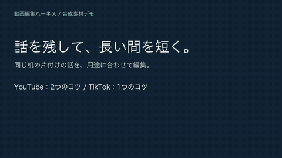

# Video Edit Harness

[English](README.md) | 日本語

開発版では `session motion-cuts` で、観察した画像の動きに合わせたカット位置をレビュー用に提案できます。非発話区間・sourceフレーム・ROIを明示し、不確かな動きでは計画を変えません。[操作と制限](docs/MOTION_CUTS.ja.md)を確認してください。開発版の `session transitions` は、指定したディゾルブ／プッシュを比較候補にし、両素材へのフィードバック・自然版比較・正確なrenderの視覚レビュー・合成済みMP4／FCP納品へつなぎます。[操作と制限](docs/TRANSITIONS.ja.md)を確認してください。実素材の受入とFCP GUIの検証はまだです。

alpha.7では、自然な編集を既定にBGM・効果音・補助素材・音ハメを指定できます。[操作ガイド](docs/EDITING_PATTERNS_USAGE.ja.md)、[実装計画](docs/EDITING_PATTERNS_PLAN_2026.ja.md)、[検証状況](docs/EDITING_PATTERNS_IMPLEMENTATION_STATUS.ja.md)を参照してください。生成素材の試験と、人による視聴・試聴やFCP GUI往復の確認は別の証拠です。

エフェクトの局所修正は `session effects`、対応パラメーターの確認は `effects-catalog` を使用します。滑らかな手動アンカーズーム・彩度演出と、同期再生・音声切替付き比較ページを追加中です。[効果の指定方法](docs/VIDEO_EFFECTS.ja.md)と[高度な編集の実装計画](docs/ADVANCED_EDITING_MAYA_PLAN_2026.ja.md)を参照してください。

開発版では、ダンスの音ハメカット・速度ランプ・ズーム・残像・文字を組み合わせた実素材の比較を検証しています。新しいvisual変速候補は実際のショット境界を保持し、同一ショットの速度変更をまたぐ残像を許可します。実際のカットをまたぐ残像は拒否します。[時間変更の制約](docs/RETIME.ja.md)と[実素材の検証状況](docs/EDITING_PATTERNS_IMPLEMENTATION_STATUS.ja.md)を参照してください。TikTokのブラウザーログイン、API接続、ネイティブ音楽／エフェクトの適用は別の状態です。現在のローカル複合演出をTikTokネイティブ適用とは表示しません。

開発版の比較ページでは、ズーム・彩度演出を「短く・速め／元の長さ／長く・ゆっくり」で調整できます。効果の中心を保って時間を変え、映像やBGMの速度は変えません。取り消しと区間確認を使って仕上げます。[操作と制約](docs/COMPARISON_ADJUSTMENTS.ja.md)。

開発版のエフェクト比較では、配置済みBGMの強さ・オフも取り消し付きで指定できます。正規化なし、または封印済みのミックス検査に元音声がある場合だけ音量欄を表示し、正規化されたBGMだけの動画ではオフを提供します。候補を全編レンダーして新しい音声を確認します。利用条件を確認した登録曲への差し替え・曲の開始秒も指定できます。映像のタイミングは保持し、新曲の音ハメは再分析・再確認が必要です。BGM変更の高速区間プレビューは未対応です。[操作と制約](docs/COMPARISON_ADJUSTMENTS.ja.md)。

固定領域と追跡した人物・字幕領域の保護には `composition_guides`、ローカル追跡には `tracking track`／`tracking validate` を使用します。`session track-effect` は観察した区間の追跡ズームと、文字の重なり・ズーム見切れの検査を未採用候補にします。[追跡と配置検査](docs/TRACKING.ja.md)にOpenCV・MediaPipeの選択と制限を記載しています。`retime prepare`／`retime render` で変速・静止保持、音声伸縮、字幕時刻の移行を単独のMP4へ描画できます。[時間変更の操作と制限](docs/RETIME.ja.md)を参照してください。visualセッションの未採用候補と変速済み映像のFCP受け渡しに対応します。FCPで編集できる時間変更は未対応です。alpha.7の発話セッションでは、単語保護と観察済みの非発話区間を伴う候補を描画できます。

alpha.7には、観察した位置へ短い文字を追従させる `tracked_title` を追加しています。`session track-effect --effect tracked_title --title-parameters-file label.json` で未採用候補を作れます。[使い方と制限](docs/TRACKING.ja.md)を確認してください。

alpha.7では、新しいvisualセッションの色調整を画像・文字の合成前に行います。原映像用LUTで文字や画像の色を変えず、既存セッションは従来の処理方式を維持します。[処理方式と移行](docs/VIDEO_EFFECTS.ja.md)を参照してください。

変速はまず素材を連結した段階の映像を確認し、観察したフレーム範囲で未採用候補を作ります。

```sh
uv run --no-sync video-harness session retime-source SESSION RENDER_ID
uv run --no-sync video-harness session retime SESSION RENDER_ID --request-file request.json --actor codex --note '観察した動作の見せ場を強調する'
uv run --no-sync video-harness session render SESSION --candidate-id CANDIDATE_ID --full
```

必要なextraとRubber Bandの準備、requestの形は [RETIME.ja.md](docs/RETIME.ja.md) を参照してください。古い明示cue・エフェクト・保護領域は候補内で失効し、採用中の編集は変わりません。追加BGMは新しい尺へ配置します。FCPには変速済み映像を渡し、編集可能な時間変更は未対応です。alpha.7の発話セッションでは `nonspoken_intervals` の観察指定が必要です。


**Codex・Claude Codeでローカルの話す動画を編集するハーネスとスキルです。** 不要な間の短縮、場面に合う色、聞きやすい音声、字幕、Final Cut Proへの受け渡しを扱います。内容と仕上がりを確認しながら、素材のハッシュ、修正履歴、納品時の証拠を一緒に管理できます。

[](https://github.com/ekusiadadus/video-edit-harness/releases/download/v0.1.0-alpha.4/youtube-demo-ja.mp4)

**[日本語音声付きで見る：編集前 → 編集後 → TikTok](https://github.com/ekusiadadus/video-edit-harness/releases/download/v0.1.0-alpha.4/youtube-demo-ja.mp4)** · [日本語YouTube版の全編](https://github.com/ekusiadadus/video-edit-harness/releases/download/v0.1.0-alpha.4/youtube-result-ja.mp4) · [日本語TikTok版の縦動画](https://github.com/ekusiadadus/video-edit-harness/releases/download/v0.1.0-alpha.4/tiktok-demo-ja.mp4) · [English demo](README.md)

この日本語デモにはオリジナルのイラスト、合成した日本語音声、日本語の字幕とラベルを使用しています。[英語デモ](README.md)には別の英語音声・字幕・ラベルを使用しています。どちらも合成素材の例で、YouTube版は二つの助言を残し、TikTok版は一つを最後まで伝えます。実際のローカル編集結果を使った比較であり、画面収録ではありません。自動検証やデモだけでは、人による試聴の承認、FCP GUIでの読み込み、実写素材の品質は証明されません。[素材の出典とオフライン再現手順](docs/demo/README.md)。

## 編集を依頼する

| 利用方法 | 通常のYouTube動画 | TikTok・Reels・Shorts |
|---|---|---|
| Codexスキル | `$youtube /path/to/talk.mov` | `$tiktok /path/to/video.mov` |
| Claude単体スキル | `/youtube /path/to/talk.mov` | `/tiktok /path/to/video.mov` |
| Claudeプラグイン | `/video-editing:youtube /path/to/talk.mov` | `/video-editing:tiktok /path/to/video.mov` |

例えば「説明のつながりと語尾を残し、不要な間を短く。アップロード禁止」と添えます。一般的な編集や色の比較には `video-editing` を使います。上記はエージェントへの依頼で、シェルコマンドではありません。

## 最初の準備

Python 3.11以上、[uv](https://docs.astral.sh/uv/)、FFmpeg、ffprobeが必要です。macOS・Linuxに対応し、Final Cut Proでの仕上げにはmacOSが必要です。Linuxで日本語字幕を焼き込む場合は日本語/CJKフォントを用意してください。

```sh
git clone --branch v0.1.0-alpha.7 https://github.com/ekusiadadus/video-edit-harness.git
cd video-edit-harness
uv sync --locked
export VIDEO_EDIT_HARNESS_ROOT="$PWD"
uv run video-harness doctor
```

**Codex：** このディレクトリで新しいセッションを開始します。3スキルは `.agents/skills/` にあります。別のプロジェクトから使う場合は必要なフォルダを `~/.agents/skills/` にコピーし、上記のハーネスパスを引き継ぎます。

**Claude Code：** コミュニティプラグインを導入して新しいセッションを開始します。

```sh
claude plugin marketplace add ekusiadadus/video-edit-harness
claude plugin install video-editing@video-edit-harness
```

正確に `/youtube`・`/tiktok` と入力したい場合は単体スキルを使います。[導入方法・ZIPの検証・バージョン診断](docs/SKILL_INSTALL.ja.md)。GitHubリリースはコミュニティ配布版で、公式キュレーションへの掲載ではありません。

## 新しい動画を増やす：素材・セッション・FCPの整理

**作品ごとに保存フォルダとハーネスのセッションを分けます。** FCPの「プロジェクト」は編集タイムライン、ハーネスの `project.json` は素材と処理設定、セッションは計画・レンダー・レビューの履歴です。同じ名前でも別の役割を持ちます。

### 素材はどこに置くか

Macでは `~/Movies/VideoProjects/`、大きな素材は接続を維持できる外付けSSDに、日付と作品名でフォルダを作る運用を推奨します。次は保存場所の例で、自動生成される固定構造ではありません。

```text
~/Movies/VideoProjects/2026-10-06-desk-tips/
├── source/                    # カメラ原本。編集・上書き・削除しない
│   └── IMG_1234.MOV
├── harness/
│   ├── brief.json             # 視聴者・目的・残す内容を構造化
│   ├── project.json           # talk.template.jsonから作る設定
│   └── session/               # この作品のセッション保存先
├── fcp/
│   └── desk-tips.fcpbundle    # FCPで作るライブラリ
└── exports/                   # FCPから書き出すmaster・配信版
```

- iPhoneなどから原本を `source/` にコピーし、ファイルが再生できることを確認してから依頼します。Downloadsや一時フォルダを長期の参照元にせず、`.fcpbundle` 内部を手で変更しません。素材移動は編集開始前に済ませます。
- ハーネスの `source` には実ファイルの**絶対パス**を指定します。外付けSSDなら `/Volumes/SSD名/.../source/IMG_1234.MOV`。開始後の原本移動・差し替えはリンクとSHA照合に影響するので、黙って変更しません。
- `project.json` は `projects/talk.template.json` をコピーして作ります。テンプレートの `input_color: apple_log` をそのまま使わず、実素材に合わせます。現在の対応値は `apple_log` と `rec709` です。HLG/PQ/Apple Log 2をこの二つへ無理に分類しません。ライブラリ名や拡張子だけでLogと判断せず、変換済みRec.709素材へLog変換を重ねません。
- 複数クリップは同じ `source/` に保管できますが、現在のハーネスは**1設定・1セッションにつき単一素材**です。フォルダを渡すだけで全クリップを自動構成する機能はありません。複数素材は個別処理とFCPでの組み立てを指定します。
- 小さく始めるなら、リポジトリ内の `media/<作品名>/`、`projects/<作品名>.json`、`sessions/<作品名>/`、`output/` も利用できます。これらはGit対象外ですが、バックアップされるという意味ではありません。

### そのまま使える依頼例

パスと作品の目的を自分のものに置き換え、ハーネスのcheckoutでCodexを開いて依頼します。素材フォルダへコードをコピーする必要はありません。

```text
$youtube /Users/your-name/Movies/VideoProjects/2026-10-06-desk-tips/source/IMG_1234.MOV
机の片付け方を紹介する日本語動画です。視聴者は初めて見る人。
二つのコツと結論を残し、語尾・呼吸・意味のある間を保って不要な間を短くしてください。
用途は通常のYouTube動画。目標は3〜5分ですが、説明のつながりを優先してください。
原本の縦横比とfpsを確認し、横動画への変更が必要なら画角案を先に提示してください。
色は自然な肌と白を優先。入力色は未確認なので、確認してから設定してください。
字幕は日本語。固有名詞は「HHKB」。
設定は同じ作品フォルダのharness/project.json、
セッションはharness/session/、依頼内容はharness/brief.jsonへ構造化して保存してください。
クラウド送信・投稿は禁止。既存の封印済み文字起こしがなければ、
まずローカルの色・音声・画角プレビューまで進めてください。
編集計画とプレビューを確認してから全編を作り、FCP用の納品場所を示してください。
```

縦動画なら `$tiktok`、色だけの比較なら `$video-editing` に替えます。文字起こしのクラウド送信を希望する場合は「このファイルのOpenAIへの送信を許可。Azureへの送信は禁止」など、**素材と送信先**を明記します。既存の許可は素材SHAに結び付けて保持します。[文字起こしの詳細](docs/TRANSCRIPTION.md)。

修正・再開では新しいセッションを作らず、次のように既存保存先を指定します。

```text
この作品のharness/session/を再開してください。新規セッションは作らないでください。
確認対象はレンダーID <実際のID>。
完成版の00:12〜00:16は間を残し、字幕「HHK」を「HHKB」に直してください。
旧版を残して修正版のプレビューを作成してください。クラウド送信・投稿は禁止。
```

時刻が原素材か完成版かを明記します。別の原素材で新しい作品を作る場合は、作品フォルダ・設定・セッションも新しくします。`session start` の保存先はまだ存在しないフォルダを指定し、再開には既存フォルダを使います。プレビュー・レビュー・納品はそのセッション配下に保存されます。`--brief-file` はMarkdownではなくJSONです。最小の例は次のとおりで、目標尺が未定なら `target_duration_seconds` を省略できます。単語IDは実際の文字起こしから取得し、例示IDを流用しません。[詳細なbrief例](examples/workflow-brief.json)。

```json
{
  "audience": "机の片付け方を初めて知る人",
  "goals": [{"id": "goal-1", "text": "二つのコツと結論を分かりやすく伝える"}],
  "target_duration_seconds": 240,
  "must_keep_word_ids": []
}
```

CLIを直接使う場合は、設定とbriefを用意してからハーネスのcheckoutで次を実行します。パスは例で、クラウド送信は実行しません。

```sh
uv run video-harness doctor
uv run video-harness session start \
  /Users/your-name/Movies/VideoProjects/2026-10-06-desk-tips/harness/project.json \
  /Users/your-name/Movies/VideoProjects/2026-10-06-desk-tips/harness/session \
  --brief-file /Users/your-name/Movies/VideoProjects/2026-10-06-desk-tips/harness/brief.json \
  --actor codex
uv run video-harness session status \
  /Users/your-name/Movies/VideoProjects/2026-10-06-desk-tips/harness/session --deep
```

この例の実行者はCodexです。自分で操作する場合は `--actor human` に替えます。クラウド方針・文字起こし・計画・レビュー以降は[セッション操作](docs/WORKFLOW.ja.md)に従います。

### Final Cut Proでの増やし方

| FCP内の単位 | 役割 | 整理例（本READMEの運用提案） |
|---|---|---|
| ライブラリ | イベント・プロジェクト・素材参照をまとめる `.fcpbundle` | 独立した案件は別ライブラリ。継続シリーズは一つにまとめてもよい |
| イベント | 撮影素材とプロジェクトを整理する単位 | `2026-10-06_desk-tips` のように撮影日・エピソードごと |
| プロジェクト | 完成動画一本の編集タイムライン | `desk-tips_youtube_r01`、`desk-tips_shorts_r01` のように用途・版ごと |

画面左の `iPhone Log 12 Looks` はライブラリ名で、その下にイベントがあります。素材のサムネイルを増やしても新しい編集タイムラインはできません。[Appleのライブラリ説明](https://support.apple.com/guide/final-cut-pro/verfdd5c590e/mac)。

1. **FCPで手動編集する場合：** 必要なら「ファイル → 新規 → ライブラリ」を作り `fcp/` に保存します。イベントを作成・選択し、「ファイル → 新規 → プロジェクト」（⌘N）でタイムラインを作ります。解像度・fps・色空間は原素材と納品目的に合わせます。今の例の1080×1920・30p・Rec.709を全素材へ固定しません。[Appleの新規プロジェクト手順](https://support.apple.com/guide/final-cut-pro/verdb79783e/mac)。
2. **ハーネスから受け渡す場合：** レビューした全編を `uv run video-harness session package SESSION RENDER_ID --target fcp --actor codex` で梱包します。`SESSION` と `RENDER_ID` は実際の保存先とIDに置き換えます。コマンド結果が示す `session/deliveries/<ID>/` 内の `timeline.fcpxml` を「ファイル → 読み込む → XML」から読み込みます。XML自体がプロジェクトなどを生成するため、空のタイムラインを先に作る必要はありません。生成されるイベント・プロジェクト名は設定の `name` に ` Edit Review` を付けたものなので、設定時に作品固有の名前を付けます。読み込み先ライブラリと生成されたイベント・プロジェクトを確認します。`project.json` をFCPへ読み込むわけではありません。[AppleのXML手順](https://support.apple.com/guide/final-cut-pro/verdbd66ae/mac)。
3. 原素材のリンク、尺・カット位置・画角、色、字幕、音声を実際に確認します。FCPXMLは色・字幕・マスク・最終音声の完全再現ではありません。納品フォルダの案内と参照動画を使って仕上げます。既存のFCP手直しがある版に新XMLを重ねず、別名のプロジェクトで比較します。
4. 確認後にマスターと配信版を `exports/` へ書き出します。[2026年の設定・品質管理](docs/FCP_BEST_PRACTICES_2026.ja.md)と[この環境での設定適用記録](docs/FCP_SETTINGS_APPLIED_2026.ja.md)も参照してください。

**原本とバックアップ：** 「ライブラリストレージへコピー」を使う場合、FCPの読み込み時に原本とは別のコピーを保存するため容量を見積もります。ライブラリの保存先はインスペクタで設定し、原本を `.fcpbundle` 内へ手で置きません。「ファイルをそのままにする」なら外部の原本パスを維持します。保存先変更だけで既存素材が移るわけではありません。[Appleの保存場所設定](https://support.apple.com/guide/final-cut-pro/ver7db6ffe77/mac)。原本・ハーネスの履歴・FCPライブラリ・マスターを別の媒体にもバックアップします。FCPの自動ライブラリバックアップはデータベースのみで、素材は含みません。[Appleのバックアップ説明](https://support.apple.com/guide/final-cut-pro/ver85d95b8a9/mac)。

## APIキーなしで試す

v0.1.0-alpha.4の[日本語の合成サンプル](https://github.com/ekusiadadus/video-edit-harness/releases/download/v0.1.0-alpha.4/demo-fixture-ja-v0.1.0-alpha.4.zip)を取得し、`DEMO-SHA256SUMS` で確認します。実測の単語時刻とライセンスを含みます。

```sh
uv run python scripts/prepare_demo.py --fixture /path/to/demo-fixture-ja-v0.1.0-alpha.4.zip \
  --output output/my-sample
```

エージェントへの依頼例：

```text
$youtube output/my-sample/sample.mp4
机の片付け方の二つの助言を残し、長い間だけを短くしてください。
output/my-sample/project.json と既存の
output/my-sample/transcript/transcript.json を使ってください。
アップロード禁止。まずプレビューを作成してください。
```

Claude単体では `$youtube` を `/youtube`、プラグインでは `/video-editing:youtube` に替えます。準備スクリプトは素材のハッシュを確認し、実測時刻を手元のパスに結び直し、クラウド送信を禁止に設定します。音声認識は実行しません。[CLIでの編集・デモ再生成](docs/demo/README.md)。

## 管理する流れ

**原素材 → 単語時刻付き文字起こし → 編集計画 → プレビュー → フィードバックと修正 → 全編レンダー → 確認済みの納品**をセッションとして保存します。再開・引き継ぎでも関連を保持します。長尺の編集点試聴では残りIDを表示し、合格記録には全編試聴か、確認したIDと確認省略の理由を残します。縦動画は素材・レンダー・字幕・フォントと独立したレビューを持ち、選んだ版を納品に含めます。完了証拠は納品フォルダの `completion.json` に入ります。

7用途と6スタイルを組み合わせます。室内トークは `indoor_talk` + `natural` を出発点とし、屋外の日中・夜・逆光には別の初期設定を使います。明度、コントラスト、中間調、彩度、ハイライト、固定領域の補正も調整できます。用途はプラットフォーム名ではなく、実際の場面で選びます。[プリセット一覧](docs/PRESET_CATALOG.md)。

文字起こしは **OpenAI → Azure OpenAI** の順です。素材と送信先への許可を記録し、不明・禁止なら再開後も送信を止めます。ローカルWhisper/ASRは使いません。APIキーだけでは送信許可にならず、API利用には料金が発生する場合があります。既存の封印済み文字起こしがあればオフラインで内容編集できます。なければローカルの色・音声・画角プレビューを進めます。送信禁止の子供の映像などは外部に送信しません。

[セッション操作とレビュー](docs/WORKFLOW.ja.md) · [縦動画の編集](docs/TIKTOK.ja.md) · [文字起こし](docs/TRANSCRIPTION.md) · [設計判断](docs/DECISIONS.md)

## 対応範囲と検証

**アルファ版：** 発話編集の平坦なタイムラインと、登録素材を使うvisual EDLに対応します。通常の動画は原素材の縦横比を保持し、9:16版は余白付きfitを標準とします。center cropは確認して明示指定します。自動顔識別・自動Bロール構成はありません。納品したMP4はユーザー本人が投稿します。観察した枠を使う追跡は別途レビューが必要です。Apple Log LUTはRec.709変換を含むため、FCPのCamera LUTとの二重変換を避けます。HDR/HLG・Apple Log 2には別の対応変換が必要です。

FCPXMLはカット時刻と素材リンクを渡します。LUT・字幕・空間マスク・FCP最終音声ミックスは別途適用と確認が必要です。XML/DTD、ハッシュ、全編デコード、フレーム対応の検証と、人の試聴・映像確認、実際のFCP取り込み、投稿先での再生を区別します。合成デモや自動チェックは実写の品質を保証しません。[リリース検証と未確認事項](docs/RELEASE_VALIDATION.md)。

```sh
make test
uv run video-harness verify /path/to/final.mp4 --output output/final-check
```

[リリースとチェックサム](https://github.com/ekusiadadus/video-edit-harness/releases/tag/v0.1.0-alpha.7) · [貢献方法](CONTRIBUTING.md) · [MITライセンス](LICENSE)。ソース、wheel、3つの単体スキルZIP、ClaudeプラグインZIPを配布します。PyPIへの公開は行っていません。

映像効果の指定は [VIDEO_EFFECTS.ja.md](docs/VIDEO_EFFECTS.ja.md) を参照。控えめ／ポップのプリセットと、時刻・強度を指定するイベントを区別し、実レンダーで検証します。

TikTok公式APIの接続設定・OAuth・本人のプロフィールと公開動画一覧の読み取りは [接続ガイド](docs/TIKTOK_API.ja.md) を参照してください。これは作業ツリーの追加機能です。投稿、音源ダウンロード、流行ランキングの取得は含みません。実アカウントとの疎通はOAuth後に別途確認します。Symphonyの実編集画面ではStock動画への区間エフェクト適用とMP4ダウンロードを確認しましたが、音楽追加・編集API連携・YouTube用途の素材権利確認は未完了です。機能確認デモを完成作品やAPI接続の証拠とは扱いません。

開発版の`native-inspect`は、外部仕上げのMP4をローカルで検査します。`session native-result`は提案と元／返却SHAの申告に結び付けて、返却動画と検査ログを保持します。音楽入りの依頼に音声がない／実質無音なら不足を示します。元の時間対応・字幕・レビューは継承せず、自動採用もしません。[操作と制限](docs/TIKTOK_API.ja.md)。

alpha.7では、日本語・英語のタイトルを実フォント幅で折り返せます。数値と単位や指定した語句を保護し、収まらない文は修正理由を返します。 [設定と制限 / Controls and limits](docs/VIDEO_EFFECTS.ja.md)。

発話セッションでは `session retime-source` で連結済み映像と単語の保護区間を確認できます。alpha.7では `nonspoken_intervals` を指定して未採用候補を描画し、字幕・元フレーム対応を移行できます。PCMの後に追加音と正規化を適用します。 [Scope / 操作と制限](docs/RETIME.ja.md)


alpha.7では `session compare-candidates SESSION NATURAL_RENDER RETIMED_RENDER --mode timing` で、同じ選択済みカットの自然版と時間変更版を比較できます。各案を個別に最後まで再生し、尺・変更操作を確認します。既定の `effects` は同じ対応表で同期する比較です。構成の並べ替え・別計画の比較はこのモードの対象外です。

alpha.7の `session audio-cuts` は、実在する素材の音声を映像より先行／延長するJ/Lカット候補を作ります。映像のフレームは維持し、発話は実単語IDから字幕を更新します。書き起こしのない素材は非発話の明示と試聴が必要です。時間変更との併用・編集可能なFCP受け渡しは未対応です。[操作・レビュー条件](docs/AUDIO_CUTS.ja.md)。

alpha.7の `motion_trail` は、指定したショット内の見せ場に過去フレームの残像を加えます。音声と尺を維持し、自然版へ自動追加しません。[指定方法とレビュー条件](docs/VIDEO_EFFECTS.ja.md)。

alpha.7の実験的な `tracked_background` は、追跡対象のフレームごとの切り抜きマスクで背景を控えめにします。手動PNGで修正でき、追跡喪失・古い依存は拒否します。実写8フレームの試行では壁・天井が前景として残り、エージェントは視覚結果を不採用としました。人によるレビューは未記録です。使用前に全輪郭を確認し、手動マスクで修正してください。人物の汎用的な切り抜きではありません。[操作と制限](docs/TRACKING.ja.md)。

開発版の `depth prepare/infer/correct/stabilize/validate/render` は、元映像に結び付けた相対深度を保持し、Smallモデルのローカル推定と反復する手動修正に対応します。`session depth-layer` は全解像度のRec.709 graded pictureと登録済み同サイズRGBA画像を結び付け、未採用候補・比較・選択・採用・baked納品に対応します。最終SHAに対する `depth_contours` 視覚レビューが必要です。納品用の深度証跡はローカルパスを除き、フィールドとSHAを保持します。モデル・元画像は外部参照です。明示指定で時間方向の補正候補を作り、信頼性が低いフレームやカットで履歴をリセットします。実写の輪郭・時間方向の品質の承認は未完了です。[操作と制約](docs/DEPTH_LAYERS.ja.md)。

開発版の `tiktok-export --caption-layout` は、日本語・英語字幕を実フォント幅で折り返し、指定語句と元SRTの時刻・手動改行を保持します。納品には元パスを含まない配置証跡を残します。[操作と制約](docs/CAPTION_LAYOUT.ja.md)。

開発版の編集可能FCP素材には、共通のピクセル計算から静的な大きさ・位置・透明度を記録します。実FCP表示の一致と音量の再現は未確認です。[操作と制約](docs/FCP_OVERLAY_PLACEMENT.ja.md)。

開発版では「否定・名前・単位を分けない字幕」を実単語IDから指定できます。`session caption-source`で表示順と出現番号を取得し、`session caption-groups --spec-file`で未採用候補を作ります。カット・発話変速・J/L音声の実時刻へ追従し、読み時間の警告とSRT証跡を保存します。[操作と制約](docs/CAPTION_GROUPS.ja.md)。通常YouTubeは別SRT、縦型MP4の焼き込みと実機の見やすさは別途確認してください。公開alpha.7には未収録です。

用途別に編集前後を見たい場合は[4種類の比較デモ仕様](docs/COMPARISON_DEMOS.ja.md)を参照してください。YouTube向け・ダンス・エフェクト・音ハメを別の音付きMP4で比較する仕様です。ローカル確認用4本は生成・技術検査済みですが、公開配布や人の最終承認とは別です。動画の投稿は利用者が行います。

開発版のエフェクト比較ページから、選んだ案の効果を弱めたり個別にオフにできます。取り消し・リセット後に修正 JSON を保存し、ハーネスへ読み込むと未採用の候補になります。修正後の映像を生成・確認してから採用します。[使い方と制約](docs/COMPARISON_ADJUSTMENTS.ja.md)。公開 alpha.7 には含まれません。

開発版 `session preview-effects SESSION REVISED_RENDER` で、修正した効果の区間を音付きで比較できます。調整前後の完成映像から同じフレーム範囲を切り出し、オフにした効果も元の区間で確認できます。区間確認と全編レビューは別です。[使い方](docs/COMPARISON_ADJUSTMENTS.ja.md)。

開発版の比較ページで、効果の適用区間と滑らかなズームの横・縦位置も変更できます。取り消し・リセットに対応し、実際の FPS に基づくフレーム位置を保存します。修正後にレンダーし、元の区間と変更先を比較します。[操作と制約](docs/COMPARISON_ADJUSTMENTS.ja.md)。

開発版 `session preview-changes SESSION CANDIDATE_ID` で、修正後の全編を待たずに効果の変更区間を確認できます。保存済みの映像・完成音声を再利用し、効果の時計と残像履歴を保ちます。区間だけの試作は採用条件や全編レビューを満たしません。[操作と制約](docs/COMPARISON_ADJUSTMENTS.ja.md)。
