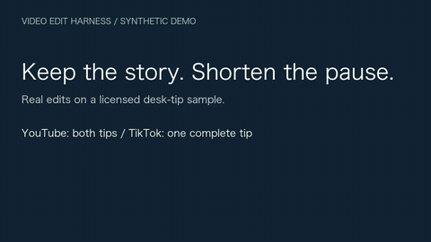

# Video Edit Harness

English | [日本語](README.ja.md)

Turn local spoken footage into coherent edits with **Codex or Claude Code**: shorter unnecessary pauses, scene-appropriate color, clear audio, matching captions and an editable Final Cut Pro timeline. You choose the story and review the result; the harness keeps source hashes, revisions and delivery evidence together.

[](https://github.com/ekusiadadus/video-edit-harness/releases/download/v0.1.0-alpha.4/youtube-demo-en.mp4)

**[Watch the English demo with sound: before → after → TikTok](https://github.com/ekusiadadus/video-edit-harness/releases/download/v0.1.0-alpha.4/youtube-demo-en.mp4)** · [Full English YouTube result](https://github.com/ekusiadadus/video-edit-harness/releases/download/v0.1.0-alpha.4/youtube-result-en.mp4) · [English 9:16 TikTok result](https://github.com/ekusiadadus/video-edit-harness/releases/download/v0.1.0-alpha.4/tiktok-demo-en.mp4) · [日本語デモ](README.ja.md)

This English demo uses an original illustration, synthetic English speech and English captions. The [Japanese demo](README.ja.md) has separate Japanese speech, captions and labels. Both are synthetic examples: the YouTube edit keeps both tips and TikTok keeps one complete tip. The comparison uses actual local renders; it is not a screen recording. Automated checks and these examples do not establish human listening approval, FCP GUI import or real-footage quality. [Provenance and offline reproduction](docs/demo/README.md).

## Ask for an edit

| Where | Regular YouTube | TikTok / Reels / Shorts |
|---|---|---|
| Codex skill | `$youtube /path/to/talk.mov` | `$tiktok /path/to/video.mov` |
| Claude standalone skill | `/youtube /path/to/talk.mov` | `/tiktok /path/to/video.mov` |
| Claude marketplace plugin | `/video-editing:youtube /path/to/talk.mov` | `/video-editing:tiktok /path/to/video.mov` |

Add your brief, for example: “Keep the explanation coherent, shorten unnecessary pauses and preserve sentence endings. Do not upload.” Use `video-editing` for general editing and color comparisons. These are agent invocations, not shell commands.

## Start here

Requires Python 3.11+, [uv](https://docs.astral.sh/uv/), FFmpeg and ffprobe. macOS or Linux; finishing in Final Cut Pro requires macOS. Install a Japanese/CJK font when burning Japanese captions on Linux.

```sh
git clone --branch v0.1.0-alpha.4 https://github.com/ekusiadadus/video-edit-harness.git
cd video-edit-harness
uv sync --locked
export VIDEO_EDIT_HARNESS_ROOT="$PWD"
uv run video-harness doctor
```

**Codex:** start a new session in the checkout; all three skills are already in `.agents/skills/`. For other projects, copy the desired skill folders to `~/.agents/skills/` and keep the harness path above available.

**Claude Code:** install the community plugin, then start a new session:

```sh
claude plugin marketplace add ekusiadadus/video-edit-harness
claude plugin install video-editing@video-edit-harness
```

For the exact `/youtube` and `/tiktok` spelling, use standalone skills instead. [Installation, verified ZIPs and version diagnosis](docs/SKILL_INSTALL.md). The planned GitHub release is a community distribution, not an official curated listing.

## Try without an API key

When v0.1.0-alpha.4 is published, download its [English synthetic fixture](https://github.com/ekusiadadus/video-edit-harness/releases/download/v0.1.0-alpha.4/demo-fixture-en-v0.1.0-alpha.4.zip) and verify it against `DEMO-SHA256SUMS`. It includes measured word timestamps and a license.

```sh
uv run python scripts/prepare_demo.py --fixture /path/to/demo-fixture-en-v0.1.0-alpha.4.zip \
  --output output/my-sample
```

Then ask your agent:

```text
Use $youtube with output/my-sample/sample.mp4. Keep both desk tips and shorten
only the long pause. Use output/my-sample/project.json and the existing sealed
output/my-sample/transcript/transcript.json. Do not upload. Make a preview first.
```

Claude standalone users replace `$youtube` with `/youtube`; plugin users use `/video-editing:youtube`. The helper verifies the source hash, reseals the real timestamps for your local path and records cloud upload as denied. It runs no speech recognition. [CLI reproduction and demo build](docs/demo/README.md).

## What the harness manages

A durable session links **source → word-timed transcript → story plan → preview → feedback/revision → full render → reviewed delivery**. Resume and handoff retain those links. Long edits expose remaining audition IDs; a passing boundary review records full listening or reviewed and explicitly waived boundaries. Portrait exports have their own source/render/subtitle/font fingerprints and review, and the selected derivative travels with the final bundle. `completion.json` carries final evidence with the delivery folder.

Seven scene use cases and six styles compose independently of the platform. Indoor talk starts with `indoor_talk` + `natural`; outdoor daylight, night and backlight have different starting settings. Exposure, contrast, midtones, saturation, highlight rolloff and fixed spatial corrections remain adjustable. Compare the same source interval before choosing a look. [Preset catalog](docs/PRESET_CATALOG.md).

Cloud transcription uses **OpenAI, then Azure OpenAI**, only for the source and providers you authorize. Unknown or denied permission blocks upload, including after resume. There is no local Whisper/ASR. An API key alone grants no permission; API calls may incur charges. Existing sealed transcripts enable offline story edits; without one, local color/audio/framing previews still work. Children's or other protected footage stays local when upload is forbidden.

[Session commands and review](docs/WORKFLOW.ja.md) · [Vertical editing](docs/TIKTOK.md) · [Cloud transcription](docs/TRANSCRIPTION.md) · [Design decisions](docs/DECISIONS.md)

## Scope and verification

**Alpha:** single-source, flat ordered timelines. Original video aspect is preserved; 9:16 derivatives use fit/padding by default and explicit center crop when reviewed. No automatic face tracking, B-roll assembly or platform posting. Apple Log LUTs include conversion to Rec.709; disable a second FCP Camera LUT. HDR/HLG and Apple Log 2 require another supported transform.

FCPXML exports cut timing and media links. LUTs, captions, spatial masks and the final FCP audio mix need separate application and review. XML/DTD validation, hashes, full decode and frame mapping prove technical properties; they do not prove natural speech, attractive grading, actual FCP import or platform playback. The synthetic demo and automated checks do not establish real-footage quality. [Release verification and remaining checks](docs/RELEASE_VALIDATION.md).

```sh
make test
uv run video-harness verify /path/to/final.mp4 --output output/final-check
```

[Release and checksums](https://github.com/ekusiadadus/video-edit-harness/releases/tag/v0.1.0-alpha.4) · [Contributing](CONTRIBUTING.md) · [MIT license](LICENSE). Source archive, wheel, three standalone skill ZIPs and a Claude plugin ZIP are provided; this release is not published to PyPI.
